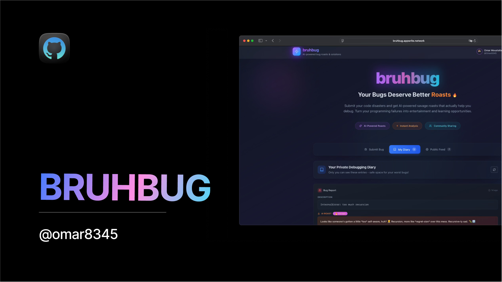

<p align="center">
  <a href="https://oops.appwrite.network" target="_blank" rel="noopener noreferrer">
    
  </a>
</p>

<h1 align="center">🔥 bruhbug</h1>
<p align="center">
  <b>Turn your code disasters into comedy gold!</b><br>
  <i>Get AI-powered bug explanations, savage roasts, and real solutions. Where debugging meets entertainment.</i><br><br>
  <a href="https://oops.appwrite.network" target="_blank">
    
  </a>
</p>

---

## 🚀 Features

- 🤖 **AI-Powered Roasts:** Get savage yet helpful bug analysis with personality
- 🔥 **Real-time Processing:** Submit bugs and get instant roasted feedback
- 📱 **Responsive Design:** Beautiful UI that works on all devices
- 🔐 **GitHub Authentication:** Secure login with your GitHub account
- 📊 **Personal Diary:** Keep track of your debugging disasters privately
- 🌍 **Community Feed:** Share your bugs publicly and learn from others
- ⚡ **Real-time Updates:** See results instantly with WebSocket subscriptions
- 🎨 **Modern UI:** Gradient-rich, glassmorphic design with smooth animations

---

## 🛠️ Getting Started

### Prerequisites

- Node.js 18+
- npm or yarn
- Appwrite Cloud account
- GitHub OAuth App (for authentication)
- Google Gemini API key (for AI roasts)

### Installation

1. **Clone the repository:**

```bash
git clone https://github.com/Omar8345/bruhbug.git
cd bruhbug
```

2. **Install dependencies:**

```bash
npm install
```

3. **Set up environment variables:**

```bash
cp .env.example .env.local
```

Fill in your environment variables:

```env
VITE_APPWRITE_ENDPOINT=https://cloud.appwrite.io/v1
VITE_APPWRITE_PROJECT_ID=your_project_id
VITE_APPWRITE_DATABASE_ID=your_database_id
VITE_APPWRITE_BUGS_COLLECTION_ID=your_collection_id
VITE_APPWRITE_FUNCTION_ID=your_function_id
```

4. **Start the development server:**

```bash
npm run dev
```

5. **Deploy the Appwrite function from the Appwrite Cloud Console**

---

## 🏗️ Architecture

### Frontend (`/src`)

- **Framework:** React 18 with TypeScript
- **Styling:** Tailwind CSS with custom gradient system
- **State Management:** React Context API
- **Build Tool:** Vite
- **UI Components:** Custom component library with shadcn/ui

### Backend (`/function`)

- **Runtime:** Node.js with Appwrite Functions
- **AI Integration:** Google Gemini API for generating roasts
- **Database:** Appwrite Database with real-time subscriptions
- **Authentication:** GitHub OAuth via Appwrite Auth

### Key Components

- **BugForm:** Submit bugs for AI analysis
- **DiaryEntryCard:** Display bug entries with roasts
- **Header:** Navigation with user authentication
- **AuthContext:** Manage user authentication state
- **useBugAI:** Handle bug submission and real-time updates

---

## 🚀 Deployment

### Appwrite Setup

1. **Create a new Appwrite project**
2. **Set up Database:**

   - Create a database
   - Create a collection for bugs with fields:
     - `userId` (string)
     - `username` (string)
     - `name` (string)
     - `avatar` (string)
     - `description` (string)
     - `roast` (string)

3. **Configure Authentication:**

   - Enable GitHub OAuth
   - Set up your GitHub OAuth app

4. **Deploy the Function using Appwrite Console**

### Frontend Deployment

Deploy to your preferred platform (Appwrite Sites, Vercel, Netlify, etc.)

---

## 🔐 Environment Variables

### Frontend (.env.local)

```env
VITE_APPWRITE_ENDPOINT=https://cloud.appwrite.io/v1
VITE_APPWRITE_PROJECT_ID=your_project_id
VITE_APPWRITE_DATABASE_ID=your_database_id
VITE_APPWRITE_BUGS_COLLECTION_ID=your_collection_id
VITE_APPWRITE_FUNCTION_ID=your_function_id
```

### Function Environment

```env
GEMINI_API_KEY=your_gemini_api_key
APPWRITE_FUNCTION_PROJECT_ID=your_project_id
APPWRITE_DATABASE_ID=your_database_id
APPWRITE_BUGS_COLLECTION_ID=your_collection_id
```

---

## 🤝 Contributing

Contributions are most welcome! Here's how you can help make bruhbug even better:

### Ways to Contribute

- 🐛 **Report Bugs:** Found a bug? Open an issue with detailed reproduction steps
- 💡 **Suggest Features:** Have an idea for improvement? Share it in discussions
- 🔧 **Fix Issues:** Browse open issues and submit pull requests
- 📚 **Improve Documentation:** Help others by enhancing docs and examples
- 🎨 **Design Improvements:** Suggest UI/UX enhancements
- 🧪 **Add Tests:** Help improve code coverage and reliability

### Code of Conduct

- Be respectful and inclusive
- Provide constructive feedback
- Focus on what's best for the community
- Show empathy towards other contributors

---

## 📦 Tech Stack

- **Frontend:** React, TypeScript, Tailwind CSS, Vite
- **Backend:** Appwrite Functions, Node.js
- **Database:** Appwrite Database
- **AI:** Google Gemini 2.5 Flash Lite API
- **Authentication:** GitHub OAuth via Appwrite
- **Deployment:** Appwrite Cloud

---

## 📄 License

This project is open source and available under the [MIT License](LICENSE).

---

## 💬 Try It and Share Your Experience

- **Live Demos:**  
  - [oops.appwrite.network](https://oops.appwrite.network)  
  - [bruhbug.appwrite.network](https://bruhbug.appwrite.network)
- **Issues:** [GitHub Issues](https://github.com/Omar8345/bruhbug/issues)  
- **Discussions:** [GitHub Discussions](https://github.com/Omar8345/bruhbug/discussions)

---

## 📧 Contact

- **Omar (Developer):**
  - Twitter: [@DevOmar100](https://x.com/DevOmar100)
  - GitHub: [Omar8345](https://github.com/Omar8345)
  - Email: yo@omarcodes.io

---

<p align="center">
  <a href="https://appwrite.io/" target="_blank" rel="noopener noreferrer" style="display:inline-flex;align-items:center;gap:4px;">
     Powered by Appwrite
  </a>
</p>

<p align="center">
  <i>Made for developers with ❤️ and a sense of humor</i>
</p>
